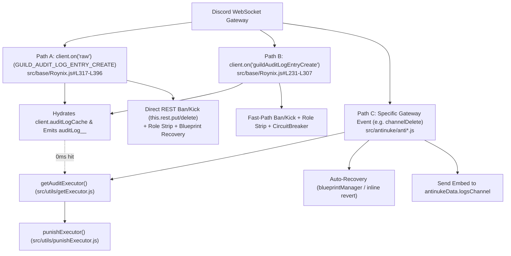

# Phase 1 — Repository Discovery & Security Architecture Map (`outh` / Roynix Shield)

**Audit Target:** `/home/roy/Documents/projects/discord bots/SECURITY`  
**Bot Identity:** `outh#6496` (`CLIENT_ID: 1370720264605925547`)  
**Audit Mode:** Strict Read-Only Evidence-Based Security Audit  

---

## 1. Runtime & Dependency Profile

| Component | Version / Specification | Evidence Location |
|---|---|---|
| **Module System** | ES Modules (`"type": "module"`) | [`package.json#L12`](file:///home/roy/Documents/projects/discord%20bots/SECURITY/package.json#L12) |
| **Discord Library** | `discord.js` `^14.22.0` (`@discordjs/builders` `^1.11.1`) | [`package.json#L14-L20`](file:///home/roy/Documents/projects/discord%20bots/SECURITY/package.json#L14-L20) |
| **Database Engine** | `better-sqlite3` `^11.9.1` wrapped by custom [`FastDB`](file:///home/roy/Documents/projects/discord%20bots/SECURITY/src/utils/fastDb.js) (SQLite WAL + 64MB `mmap` + L1 `Map` cache) | [`package.json#L18`](file:///home/roy/Documents/projects/discord%20bots/SECURITY/package.json#L18), [`src/utils/fastDb.js#L14-L72`](file:///home/roy/Documents/projects/discord%20bots/SECURITY/src/utils/fastDb.js#L14-L72) |
| **HTTP / Health Server** | `express` `^5.1.0` | [`package.json#L24`](file:///home/roy/Documents/projects/discord%20bots/SECURITY/package.json#L24), [`src/index.js#L1-L108`](file:///home/roy/Documents/projects/discord%20bots/SECURITY/src/index.js#L1-L108) |
| **Developer Eval Tool** | `dokdo` `^1.0.1` (installed in `package.json`, not wired in handlers) | [`package.json#L21`](file:///home/roy/Documents/projects/discord%20bots/SECURITY/package.json#L21) |
| **Lockfile** | `package-lock.json` (npm) | [`package-lock.json`](file:///home/roy/Documents/projects/discord%20bots/SECURITY/package-lock.json) |

---

## 2. Entry Points & Startup Lifecycle

1. **Sharded Entry Point ([`src/shard.js`](file:///home/roy/Documents/projects/discord%20bots/SECURITY/src/shard.js#L1-L25))**:
   - Default `npm start` target (`"main": "src/shard.js"`).
   - Instantiates Discord.js `ShardingManager` pointing to `./src/index.js` with `totalShards: 'auto'` and `respawn: true`.
2. **Single-Process / Worker Entry Point ([`src/index.js`](file:///home/roy/Documents/projects/discord%20bots/SECURITY/src/index.js#L70-L112))**:
   - Instantiates `const client = new Roynix()`.
   - Starts Express HTTP server on `process.env.PORT || process.env.API_PORT || 3000` exposing `/`, `/health`, `/ping`, and `/api/stats`.
   - Starts self-ping keep-alive loop ([`src/utils/keepAlive.js`](file:///home/roy/Documents/projects/discord%20bots/SECURITY/src/utils/keepAlive.js)) if `RENDER_EXTERNAL_URL` or `KEEPALIVE_URL` is set.
   - Calls `client.start()`.
3. **Slash Command Deployment Script ([`src/deploy.js`](file:///home/roy/Documents/projects/discord%20bots/SECURITY/src/deploy.js#L1-L63))**:
   - Standalone script (`node src/deploy.js`) that recursively scans `src/commands/slash/**` and executes `rest.put(Routes.applicationCommands(config.clientId), { body: commands })`.
4. **Shutdown Logic**:
   - **Finding**: No `SIGINT` / `SIGTERM` graceful shutdown listener exists in `src/index.js` or `src/base/Roynix.js`. If the process terminates while a microtask SQLite WAL batch (`FastDB.dirtySet`) is pending, queued writes in that microtask could be lost if killed via `SIGKILL`, though `queueMicrotask` flushes before the next event loop tick.

---

## 3. Repository Structure (Security-Relevant Modules)

```text
SECURITY/
├── package.json
├── src/
│   ├── index.js                         # Worker entry point & Express health/stats server
│   ├── shard.js                         # ShardingManager entry point
│   ├── deploy.js                        # Global application (/) command registrar
│   ├── base/
│   │   ├── Roynix.js                    # Core Client class, DB initialization, 0ms Audit & Raw WS Fast-Path
│   │   └── Cryptora.js                  # Alias re-export of Roynix
│   ├── config/
│   │   ├── config.js                    # Environment config loader & fallback defaults
│   │   └── emojis.js                    # Custom emoji ID definitions
│   ├── handlers/
│   │   ├── antinuke.js                  # Dynamic loader for all src/antinuke/*.js modules
│   │   ├── anticrash.js                 # Process unhandledRejection / uncaughtException handler
│   │   ├── commandHandler.js            # Prefix & Slash command loader
│   │   ├── eventHandler.js              # Standard Discord event loader (src/events/**)
│   │   └── logging.js                   # Server audit/event logging loader (src/logging/**)
│   ├── antinuke/                        # 23 AntiNuke Event & Quarantine Modules
│   │   ├── antiBan.js
│   │   ├── antiBot.js
│   │   ├── antiChannelCreate.js
│   │   ├── antiChannelDelete.js
│   │   ├── antiChannelUpdate.js
│   │   ├── antiEmojiCreate.js
│   │   ├── antiEmojiDelete.js
│   │   ├── antiEmojiUpdate.js
│   │   ├── antiGuildUpdate.js
│   │   ├── antiKick.js
│   │   ├── antiMemberUpdate.js
│   │   ├── antiPing.js
│   │   ├── antiPrune.js
│   │   ├── antiRoleCreate.js
│   │   ├── antiRoleDelete.js
│   │   ├── antiRoleUpdate.js
│   │   ├── antiStickerCreate.js
│   │   ├── antiStickerDelete.js
│   │   ├── antiStickerUpdate.js
│   │   ├── antiUnban.js
│   │   ├── antiWebhookUpdate.js
│   │   └── zeroTrustQuarantine.js
│   ├── commands/
│   │   ├── prefix/antinuke/antinuke.js  # Prefix command (!antinuke)
│   │   └── slash/antinuke/antinuke.js   # Slash command (/antinuke)
│   └── utils/
│       ├── antinukeModules.js           # Registry of 24 advertised AntiNuke module keys & names
│       ├── blueprintManager.js          # In-memory Guild Blueprint & Hierarchical Auto-Recovery Engine
│       ├── circuitBreaker.js            # Burst detection (2 events / 2s) & emergency lockdown
│       ├── fastDb.js                    # Native C++ better-sqlite3 WAL + L1 Map database engine
│       ├── getExecutor.js               # Hybrid WebSocket cache + coalesced REST Audit Log resolver
│       ├── isBotOwner.js                # Global Bot Owner check against config.owners
│       └── punishExecutor.js            # Deduplicated Ban / Kick + Emergency Role Strip executor
```

---

## 4. Data Flow & Multi-Layer Detection Architecture

When a destructive action occurs in a protected guild, **three parallel execution paths** can be triggered simultaneously:



---

## 5. Database Access Paths & Schema

All 23 database files reside in `database/*.db` and are instantiated in [`src/base/Roynix.js#L101-L128`](file:///home/roy/Documents/projects/discord%20bots/SECURITY/src/base/Roynix.js#L101-L128):
- **Primary Security Database**: `client.antinukeDB` (`database/antinuke.db`)
- **Key Format**: `antinukeData_<guildId>`
- **Record Schema**:
  ```json
  {
    "enabled": true,
    "extraOwners": ["<userId>"],
    "whitelisted": {
      "<userId>": {
        "events": ["antiChannelDelete", "antiRoleCreate"]
      }
    },
    "whitelistedRoles": {},
    "protectRole": "<roleId | null>",
    "logsChannel": "<channelId | null>",
    "punishment": "ban | kick",
    "disabledEvents": ["<moduleKey>"]
  }
  ```
- **Cache Sync**: [`src/base/Roynix.js#L161-L215`](file:///home/roy/Documents/projects/discord%20bots/SECURITY/src/base/Roynix.js#L161-L215) monkey-patches `this.antinukeDB.set` and `this.antinukeDB.delete` to keep `this.antinukeCache` (`Map<guildId, antinukeData>`) synchronized on writes.

---

## 6. Environment Variables (Names Only — Secrets Redacted)

Referenced in [`src/config/config.js`](file:///home/roy/Documents/projects/discord%20bots/SECURITY/src/config/config.js) and [`src/index.js`](file:///home/roy/Documents/projects/discord%20bots/SECURITY/src/index.js):
- `TOKEN` (Discord Bot Token)
- `CLIENT_ID` (Discord Application ID)
- `PREFIX` (Default command prefix)
- `PORT` / `API_PORT` (Express HTTP bind port)
- `BOT_COLOR` (Default embed color integer)
- `OWNERS` (Comma-separated Bot Owner IDs — defaults to hardcoded `'788970167907778562'` if unset!)
- `DEVELOPERS` (Comma-separated Developer IDs)
- `BANNER_URL` (Default embed banner URL)
- `SUPPORT_SERVER` (Support server invite URL)
- `ERROR_WEBHOOK_URL` (Discord Webhook URL used by `src/handlers/anticrash.js` — **Note**: Hardcoded fallback webhook exists in [`src/config/config.js#L20`](file:///home/roy/Documents/projects/discord%20bots/SECURITY/src/config/config.js#L20))
- `SPOTIFY_CLIENT_ID`, `SPOTIFY_CLIENT_SECRET`
- `LAVALINK_NAME`, `LAVALINK_URL`, `LAVALINK_AUTH`, `LAVALINK_SECURE`
- `RENDER_EXTERNAL_URL`, `KEEPALIVE_URL`

---

## 7. Unresolved Dependencies, Dead Code & Missing Tests

1. **Zero Automated Tests**: There are no unit, integration, or regression test files anywhere in the repository.
2. **Dead Configuration Property (`whitelistedRoles`)**: `whitelistedRoles` is initialized in `antinuke enable` ([`slash/antinuke.js#L172`](file:///home/roy/Documents/projects/discord%20bots/SECURITY/src/commands/slash/antinuke/antinuke.js#L172), [`prefix/antinuke.js#L140`](file:///home/roy/Documents/projects/discord%20bots/SECURITY/src/commands/prefix/antinuke/antinuke.js#L140)), but no command manages it and no antinuke handler reads it.
3. **Unused Audio Libraries**: `kazagumo`, `rainlink`, and `shoukaku` are listed in `package.json`, and `Nodes` is declared unused in [`src/base/Roynix.js#L65-L72`](file:///home/roy/Documents/projects/discord%20bots/SECURITY/src/base/Roynix.js#L65-L72).
