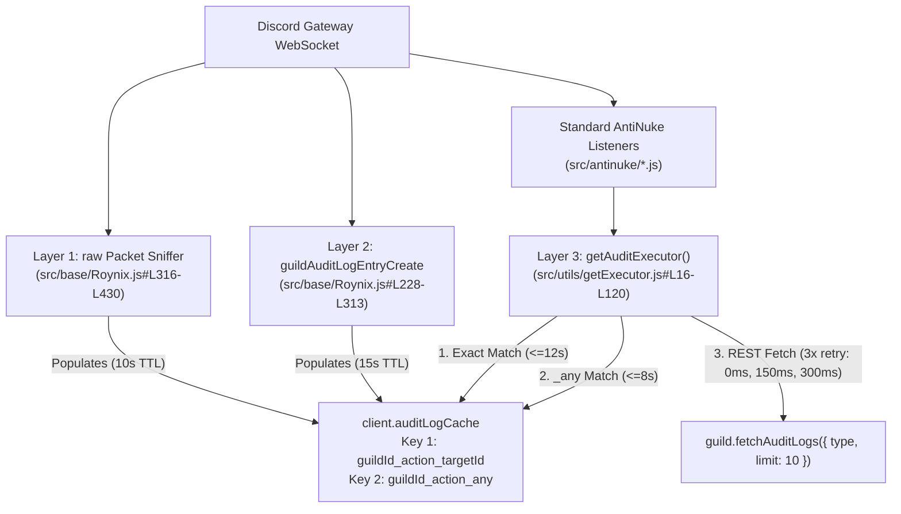

# Phase 4 — Audit-Log Attribution and Event Detection Audit (`outh#6496`)

**Audit Date:** 2026-10-10  
**Target Repository:** `/home/roy/Documents/projects/discord bots/SECURITY`  
**Audit Mode:** Strict Read-Only Static Analysis  

---

## 1. Attribution Architecture Overview

Discord Gateway events such as `channelDelete`, `roleDelete`, `guildBanAdd`, and `guildMemberUpdate` do **not** include the responsible actor (`executorId`) in their payload. The bot resolves the responsible executor through a three-layer attribution pipeline:



### Layer 1: Raw WebSocket Audit-Log Sniffer ([`src/base/Roynix.js#L316-L430`](file:///home/roy/Documents/projects/discord%20bots/SECURITY/src/base/Roynix.js#L316-L430))
- Intercepts raw `GUILD_AUDIT_LOG_ENTRY_CREATE` packets directly from Discord's WebSocket before Discord.js instantiates classes.
- Stores `{ executorId, targetId, actionType, changes, reason, timestamp }` in `client.auditLogCache` under both:
  - Exact key: `${guildId}_${actionType}_${targetId || 'any'}`
  - Wildcard key: `${guildId}_${actionType}_any`
- Immediately executes fast-path containment (HTTP ban/kick) and channel/role reconstruction for actions `12` (`ChannelDelete`), `32` (`RoleDelete`), `22` (`MemberBanAdd`), `20` (`MemberKick`), `10` (`ChannelCreate`), and `30` (`RoleCreate`).

### Layer 2: Discord.js `guildAuditLogEntryCreate` Listener ([`src/base/Roynix.js#L228-L313`](file:///home/roy/Documents/projects/discord%20bots/SECURITY/src/base/Roynix.js#L228-L313))
- Listens to Discord.js's parsed `Events.GuildAuditLogEntryCreate`.
- Resolves and caches `{ executor, targetId, createdTimestamp }` in `client.auditLogCache` for 15 seconds under both exact (`${guild.id}_${action}_${targetId}`) and wildcard (`${guild.id}_${action}_any`) keys.
- Executes a secondary fast-path containment + Circuit Breaker hook for critical actions (`ChannelDelete`, `RoleDelete`, `MemberBanAdd`, `MemberKick`, `WebhookCreate`, `BotAdd`).

### Layer 3: [`getAuditExecutor(guild, type, targetId)`](file:///home/roy/Documents/projects/discord%20bots/SECURITY/src/utils/getExecutor.js#L16-L120)
Called by all standard listeners in `src/antinuke/*.js`:
1. **Step 1 — Exact Cache Lookup ([`#L22-L38`](file:///home/roy/Documents/projects/discord%20bots/SECURITY/src/utils/getExecutor.js#L22-L38))**: Checks `client.auditLogCache.get(`${guild.id}_${type}_${targetId}`)` with a `12,000ms` freshness window.
2. **Step 2 — Wildcard `_any` Cache Lookup ([`#L39-L55`](file:///home/roy/Documents/projects/discord%20bots/SECURITY/src/utils/getExecutor.js#L39-L55))**: Checks `client.auditLogCache.get(`${guild.id}_${type}_any`)` with an `8,000ms` freshness window **ignoring `targetId`**.
3. **Step 3 — Coalesced REST Poll ([`#L58-L118`](file:///home/roy/Documents/projects/discord%20bots/SECURITY/src/utils/getExecutor.js#L58-L118))**: Calls `guild.fetchAuditLogs({ type, limit: 10 })` up to 3 times (`0ms`, `150ms`, `300ms` delays):
   - First looks for an exact `targetId` match within `15,000ms` ([`#L92-L100`](file:///home/roy/Documents/projects/discord%20bots/SECURITY/src/utils/getExecutor.js#L92-L100)).
   - Falls back to `fetchedLogs.entries.first()` within `6,000ms` **even if `entry.target.id !== targetId`** ([`#L103-L108`](file:///home/roy/Documents/projects/discord%20bots/SECURITY/src/utils/getExecutor.js#L103-L108)).

---

## 2. Confirmed Attribution & Event Detection Vulnerabilities

### [ATTR-01] Critical: Cross-Attribution via `_any` Cache Key & `.first()` Fallback (False-Positive Ban Risk)
- **Severity:** **Critical (P0)**
- **Location:**
  - [`src/utils/getExecutor.js#L39-L55`](file:///home/roy/Documents/projects/discord%20bots/SECURITY/src/utils/getExecutor.js#L39-L55) (`_any` cache fallback)
  - [`src/utils/getExecutor.js#L59-L64`](file:///home/roy/Documents/projects/discord%20bots/SECURITY/src/utils/getExecutor.js#L59-L64) (`pendingFetches` coalescing key `${guild.id}_${type}` without `targetId`)
  - [`src/utils/getExecutor.js#L103-L108`](file:///home/roy/Documents/projects/discord%20bots/SECURITY/src/utils/getExecutor.js#L103-L108) (`fetchedLogs.entries.first()` fallback)
- **Evidence:**
  ```javascript
  // src/utils/getExecutor.js#L39-L42
  const anyKey = `${guild.id}_${type}_any`;
  const anyCached = guild.client.auditLogCache.get(anyKey);
  if (anyCached && (now - anyCached.createdTimestamp) < 8000) {
      if (anyCached.executor) return anyCached.executor;
  ```
  ```javascript
  // src/utils/getExecutor.js#L59-L64
  const fetchKey = `${guild.id}_${type}`;
  if (pendingFetches.has(fetchKey)) {
      return pendingFetches.get(fetchKey);
  }
  ```
  ```javascript
  // src/utils/getExecutor.js#L103-L108
  if (!entry) {
      const latest = fetchedLogs.entries.first();
      if (latest && (Date.now() - latest.createdTimestamp) < 6000) {
          entry = latest;
      }
  }
  ```
- **Vulnerability Analysis:**
  1. **Cross-Target Attribution (`_any` and `.first()`)**: Every time *any* audit log of type `T` arrives, `${guild.id}_${type}_any` is overwritten with that executor. If Event A (performed by Actor X on Target 1) occurs, and within 6–8 seconds Event B (on Target 2) fires where Discord either does not generate an audit log (e.g., an integration/bot role auto-deleted when a bot leaves, or a temporary voice channel deleted by another system) or delays the audit log for Target 2 by 50ms:
     - `getAuditExecutor(guild, type, target2)` misses the exact key `${guild.id}_${type}_${target2}`, immediately hits `${guild.id}_${type}_any` (populated by Actor X on Target 1), and attributes Target 2's event to Actor X!
     - Conversely, if an **unwhitelisted Moderator** legitimately updates/deletes one item (where they had permission or where a bot performed the second action), or if two moderators perform actions within 6 seconds of each other, the wrong executor can be blamed and banned, or an attacker's action can be misattributed to a whitelisted admin who acted 2 seconds earlier (allowing the attacker's action to **bypass** containment!).
  2. **Coalesced Promise Collision (`pendingFetches`)**: `pendingFetches` is keyed by `${guild.id}_${type}` instead of `${guild.id}_${type}_${targetId}`. If two different channels (`C1` and `C2`) are deleted concurrently by two different users (one whitelisted, one attacker), the call for `C2` awaits the in-flight Promise started for `C1` and receives `C1`'s executor!
- **Remediation:**
  - Key `pendingFetches` by `${guild.id}_${type}_${targetId || 'any'}`.
  - When `targetId` is explicitly provided to `getAuditExecutor(guild, type, targetId)`, **require** `entry.targetId === targetId` (or `entry.target?.id === targetId`). Only allow `_any` / `.first()` when `targetId === null` (such as `MemberPrune` where Discord audit logs have no `targetId`).

---

### [ATTR-02] Critical: Premature Bot Ban & Null Executor Crash in `antiBot.js`
- **Severity:** **Critical (P0)**
- **Location:** [`src/antinuke/antiBot.js#L22-L64`](file:///home/roy/Documents/projects/discord%20bots/SECURITY/src/antinuke/antiBot.js#L22-L64)
- **Evidence:**
  ```javascript
  // Line 22: Only checks if the joining bot's own ID is already in whitelisted
  if (antinukeData?.whitelisted?.[member.id]?.events?.includes('antiBot')) return;
  ...
  // Line 34: BANS THE BOT BEFORE CHECKING WHO INVITED IT!
  await guild.bans.create(member.id, { reason: 'Roynix Antinuke: Unverified Bot Addition' }).catch(() => null);

  const executor = await getAuditExecutor(guild, AuditLogEvent.BotAdd, member.id);
  const extraOwners = antinukeData.extraOwners || [];

  if (executor) {
      if (
          executor.id === guild.ownerId ||
          executor.id === client.user.id ||
          isBotOwner(executor.id) ||
          extraOwners.includes(executor.id) ||
          antinukeData?.whitelisted?.[executor.id]?.events?.includes('antiBot')
      ) return;
  }
  ...
  // Line 63: Unchecked executor.id outside `if (executor)` block!
  `- **Action Executor:** <@${executor.id}> (\`${executor.id}\`)\n`
  ```
- **Vulnerability Analysis:**
  1. **Premature Ban of Authorized Bots**: Line 34 unconditionally bans `member.id` *before* line 38 resolves `executor`. If the Server Owner (`guild.ownerId`), Bot Owner, Extra Owner, or an `antiBot`-whitelisted administrator invites a new bot to the server without first running `/antinuke whitelist add <bot_id>` (which isn't even possible via prefix `!antinuke whitelist add` before the bot joins the guild!), `antiBot.js` bans the newly invited bot immediately.
  2. **Uncaught TypeError on Null Executor**: If `getAuditExecutor` returns `null` (e.g. missing `ViewAuditLog` permission or audit log delay > 450ms), execution skips the `if (executor)` block at lines 41–51 and reaches line 63, where `executor.id` throws `TypeError: Cannot read properties of null (reading 'id')`.
- **Remediation:**
  1. Resolve `executor = await getAuditExecutor(guild, AuditLogEvent.BotAdd, member.id)` **first**.
  2. If `!executor`, or if `executor` is NOT authorized (`guild.ownerId`, `isBotOwner`, `extraOwners`, or `whitelisted[executor.id].events.includes('antiBot')`), **then** ban both `member.id` (the unauthorized bot) and punish `executor.id` (if `executor` is non-null).
  3. If `executor` *is* authorized, allow the bot to remain in the server without banning it.
  4. Guard `executor?.id` in the log embed when `executor` is `null`.

---

### [ATTR-03] High: Broken Event Name (`webhooksUpdates`) & Invalid Cache Key in `antiWebhookUpdate.js`
- **Severity:** **High (P1)**
- **Location:** [`src/antinuke/antiWebhookUpdate.js#L14-L53`](file:///home/roy/Documents/projects/discord%20bots/SECURITY/src/antinuke/antiWebhookUpdate.js#L14-L53)
- **Evidence:**
  ```javascript
  // Line 14: Invalid Discord.js event name (extra trailing 's')
  client.on('webhooksUpdates', async (channel) => {
  ...
      // Line 35: Invalid cache key (guild.id instead of guild.id_action_targetId)
      if (client.auditLogCache && client.auditLogCache.has(guild.id)) {
          const cached = client.auditLogCache.get(guild.id);
  ```
- **Vulnerability Analysis:**
  1. Discord.js v14 emits `Events.WebhooksUpdate` (`'webhooksUpdate'`), **not** `'webhooksUpdates'`. Consequently, `src/antinuke/antiWebhookUpdate.js` is dead code that never executes.
  2. Even if triggered, line 35 checks `client.auditLogCache.has(guild.id)`, which never matches `${guild.id}_${action}_${targetId}`, and line 41 only fetches `AuditLogEvent.WebhookUpdate` (ignoring `AuditLogEvent.WebhookCreate` and `AuditLogEvent.WebhookDelete`).
  3. While `Roynix.js#L261` (`guildAuditLogEntryCreate`) punishes `AuditLogEvent.WebhookCreate`, **neither** `Roynix.js` nor `antiWebhookUpdate.js` deletes the newly created malicious webhook (`webhook.delete()`) unless the Circuit Breaker trips (>= 2 events in 2s), leaving a single attacker-created webhook active for external spam/raid execution.
- **Remediation:**
  - Change `'webhooksUpdates'` to `'webhooksUpdate'` (`Events.WebhooksUpdate`).
  - Query `getAuditExecutor` across `WebhookCreate`, `WebhookUpdate`, and `WebhookDelete` (or handle all three directly in `guildAuditLogEntryCreate`).
  - On unauthorized `WebhookCreate` or `WebhookUpdate`, fetch the channel/guild webhooks and immediately delete any webhook created/modified by the unauthorized executor.

---

### [ATTR-04] Medium: Missing Self-Action / Bot-Action Guards Producing Duplicate API Calls Between `Roynix.js` and `src/antinuke/*.js`
- **Severity:** **Medium (P2)**
- **Location:** [`src/base/Roynix.js#L368-L428`](file:///home/roy/Documents/projects/discord%20bots/SECURITY/src/base/Roynix.js#L368-L428) vs `src/antinuke/antiChannelDelete.js`, `antiRoleDelete.js`, `antiBan.js`, `antiKick.js`, `antiChannelCreate.js`, `antiRoleCreate.js`
- **Vulnerability Analysis:**
  When an unauthorized user deletes a channel or role:
  1. `Roynix.js` (`raw` `GUILD_AUDIT_LOG_ENTRY_CREATE`) bans the user and starts channel/role reconstruction.
  2. `Roynix.js` (`guildAuditLogEntryCreate`) fires `punishExecutor` again (caught by `punishLock` in `punishExecutor.js`, which returns `null` when locked).
  3. `antiChannelDelete.js` / `antiRoleDelete.js` also fires on `channelDelete` / `roleDelete`, calls `punishExecutor` (which returns `null` because `punishLock` is already held by `guildAuditLogEntryCreate`!), and then logs `- **Action Taken:** Failed` in the security log embed (`actionTaken || 'Failed'`) even though the attacker was **already banned** by `Roynix.js`!
  4. Furthermore, both `Roynix.js#L380-L407` and `antiChannelDelete.js#L51-L132` attempt to recreate the deleted channel concurrently! Although `channelReconstructionLock` is checked at `antiChannelDelete.js#L52`, `Roynix.js#L380` does **not** set `channelReconstructionLock.add(guild.id)`, causing **duplicate channel and role recreation** (2 copies of the deleted channel/role created per deletion)!
- **Evidence:**
  - [`src/base/Roynix.js#L380-L426`](file:///home/roy/Documents/projects/discord%20bots/SECURITY/src/base/Roynix.js#L380-L426) recreates the deleted channel and role directly in the `raw` sniffer without acquiring `client.channelReconstructionLock` or marking the target ID as already recovered.
  - [`src/antinuke/antiChannelDelete.js#L51-L132`](file:///home/roy/Documents/projects/discord%20bots/SECURITY/src/antinuke/antiChannelDelete.js#L51-L132) and [`src/antinuke/antiRoleDelete.js#L52-L85`](file:///home/roy/Documents/projects/discord%20bots/SECURITY/src/antinuke/antiRoleDelete.js#L52-L85) also recreate the exact same deleted channel and role milliseconds later.
- **Remediation:**
  - Track recovered target IDs in a short-lived `Set` (`client.recoveredTargets`, 30s TTL) so a deleted channel (`channel.id`) or role (`role.id`) is only reconstructed **once**, preferably by the richer `antiChannelDelete.js` / `antiRoleDelete.js` / `autoRecovery.js` handler that restores category order, permission overwrites, and member role assignments.
  - Have `punishExecutor` return `'Already Punished (Fast-Path)'` instead of `null` when `punishLock` is active so log embeds accurately report containment status.
